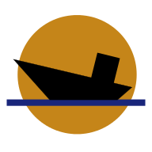

# SeaMates Web

A React powered website and social network for work shift monitoring and sharing. Never lose track when your friends are around!

Check the live version at https://seamates.herokuapp.com!

## Description
SeaMates web uses the [Marine Scheduler API](https://github.com/rodrigo-sp17/marine-scheduler) as the backend. It is a React web app that communicates over REST endpoints with the backend.

This repository contains only the frontend code. For full functionality, it must be merged with Marine Scheduler.

## Requirements
Before starting, you will need to have npm and React installed.
The following dependencies are part of the project as well:
- [Material-UI](https://material-ui.com/)
- [Formik + Yup](https://formik.org/)
- [React Router](https://reactrouter.com/)
- [FullCalendar](https://fullcalendar.io/)
- [date-fns](https://date-fns.org/)
- [Formik Material-UI](https://stackworx.github.io/formik-material-ui/)

## Usage
1. Clone the repository.

2. cd into the project root.

3. To start the development server for preview, enter:
    
    `npm start`
   
   The website will be available at http://localhost:3000

4. To build the project for production, enter:
    
    `npm run build`

## Tech Stack
- [React](https://reactjs.org/)
- [Material-UI](https://material-ui.com/)
- [Formik + Yup](https://formik.org/)
- [React Router](https://reactrouter.com/)

## License
[GPL-3.0](https://choosealicense.com/licenses/gpl-3.0)
